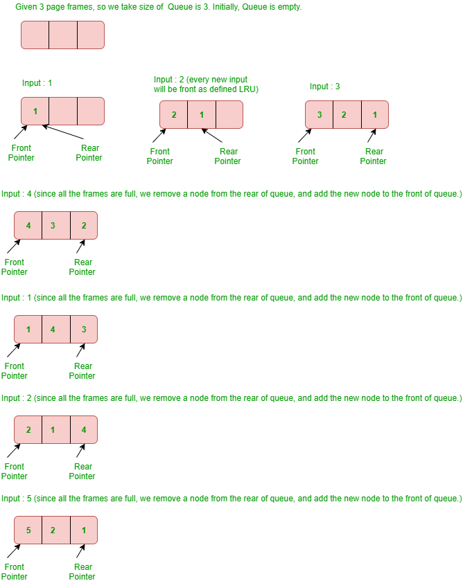

# LRU Cache base on golang/groupcache/lru

本文根据**golang/groupcache/lru** package对LRU cache的实现原理进行解析。

官方文档：
- 接口文档地址：https://pkg.go.dev/github.com/golang/groupcache/lru?tab=doc
- 源码地址：https://github.com/golang/groupcache/tree/master/lru

## 技术实现

### LRU Cache，Least Recently Used

**理论：**

LRU是缓存中淘汰算法的一种，最近最少使用。

当缓存容量不在时，淘汰最久未使用的元素。

### 举例

- LRU缓存的容量为3，
- 需要入队顺序：`1, 2, 3, 4, 1, 2, 5, 1, 2, 3, 4, 5`

### 实现

在此分析`golang/groupcache/lru`的实现原理：

- 外部依赖：
    - 依赖系统库：`container/list`

        作用：提供双向链表

        重要的数据结构：

        1. Element：列表中的元素
        2. List：双向列表
- 内部实现：
    - **结构体：type Cache struct**
        1. LRU缓存的主体
        2. 非线程安全
        3. 重要成员：
            1. 缓存最大容量：

                `MaxEntries int`

                MaxEntries为0时，不限制长度。

            2. 淘汰时，清理元素的回调函数：

                `OnEvicted func(key Key, value interface{})`

            3. list列表：

                `ll *list.List`

                双向列表ll中存放所有的元素，最新访问的元素放在列表头，最久未访问的元素放在列表尾部，这种结构就能快速定位到最久未访问的元素。

                淘汰时，淘汰列表尾部的元素。

            4. cache：

                `cache map[interface{}]*list.Element`

                存放缓存的所有元素，用于查找某一个元素是否在缓存中，查找时间复杂度为O(1)。

    - 对外接口：
        - New：创建新的缓存
        - Add：添加到缓存中

            通过元素的key在cache成员中查找当前key是否已经存在：

            - 存在：
                1. 将当前元素移动到列表头部
                2. 更新当前元素的value为新增的value
                3. 结束
            - 不存在：
                1. 新建元素（entry{key, value}）到列表头部
                2. 将新元素添加到cache中
                3. 如果列表长度超出容量，则淘汰最老的那个元素
                    1. 从列表中删除队尾元素
                    2. 删除cache map中key的元素
                    3. （可选）如果清除回调元素OnEvicted不为空，则调用该回调函数
        - Get：获取key的元素

            通过key查询cache map能以**O(1)**的时间复杂度获取元素是否在缓存中。

            查询cache map中的key，

            - 如果不在缓存中，则返回没有找到
            - 如果在缓存中，则：
                1. 将当前元素移动到列表头，**时间复杂度O(1)**
                2. 返回查询结果
        - Remove：删除元素key

            查找cache map，

            - key不在cache中，则直接返回
            - key在cache中，
                1. 删除列表中的元素
                2. 删除cache map中的元素
                3. （可选）调用清除回调函数
        - RemoveOldest：从缓存中删除最老的元素

            最“老”的元素，在这里为最久没有访问的元素，保存在列表的尾部。

            获取尾部元素后，进行删除清理。

        - Len：缓存的长度
        - Clear：清空缓存中所有的元素

    **实现细节讨论：**

    - 为什么需要两个数据结构存放所有的缓存元素？
        - 空间复杂度讨论：

            cache map和列表ll中保存的是元素的地址，对于实际内存的消耗只占用1份

        - 时间复杂度讨论：

            如果只使用其中一种数据结构的话，会有什么问题呢？

            1. 只使用list：不能以O(1)的时间复杂度查找key是否在cache中。
            2. 只使用map：不能以O(1)的时间复杂度找到最久未使用的元素。