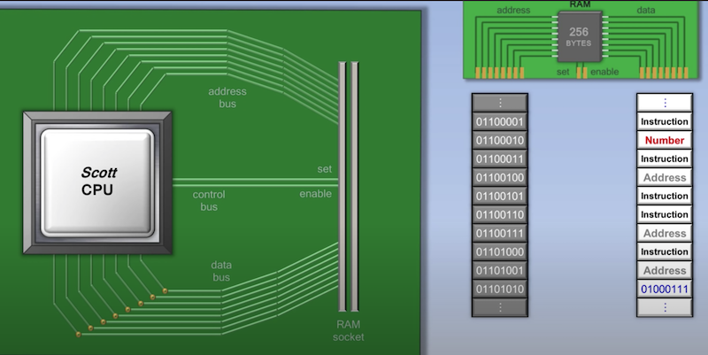

# [UnderHood] Go如何通过cgo调用c函数


## 前言

最近在工作中经常会用到cgo，在此之间也遇到了不少的问题，也有不少人问我cgo底层是怎么工作的，所以在此把我自己的疑问和别人问我的问题汇总一下，一并梳理清晰。

### 常见问题

- [ ] cgo是如何工作的？
- [ ] cgo的函数调用跟普通的函数调用有什么区别？
- [ ] go stack和c stack会不会出现问题？
- [ ] cgo是不是慢？为什么？

## 正文

根据上面的问题，慢慢剖析cgo吧。以下只是个人理解，可能有误。

### 问题一：cgo是如何工作的？

对于操作系统来说，无论是C、Go编写的函数，无非是一堆指令，最终对于操作系统来说都是一堆指令。



[图片参考：How CPU WORKS](https://www.youtube.com/watch?v=cNN_tTXABUA)


在Go中，对于普通Go函数的调用主要是两个步骤：

1. 创建新的stack
2. 传入两部分输入：1）函数地址；2）函数入参。

那么，使用cgo对C的函数调用是如何进行的呢？


**1、代码分析**

从demo开始，具体代码如下：

```go
package main

/*
typedef struct person {
	char* name;
	int score1;
	int score2;
} person;

person get_person() {
	person zy;
	zy.name = "zouying";
	zy.score1 = 100;
	zy.score2 = 100;

	return zy;
}

int sum(int a, int b) { return a+b; }
*/
import "C"
import "log"

func SayHello() { println("hello ZOUYING") }

func main() {

	SayHello()

	p := C.get_person()
	log.Printf("%#v, size of person: %d", p, C.sizeof_struct_person)

	value := C.sum(p.score1, p.score2)
	println("score=", value)
}
```

在代码中，

- 定义了1个结构体person
- 定义了2个C函数：一个是没有输入只有输出，一个是有输入和输出。需要注意的是：
  - C相关的代码必须定义在注释中，可以包含：函数、变量的声明和定义。函数、变量名可以想象成被定义在`"C" package`中。
  - `import "C"`跟上面C的代码不能有空行。否则会报错：`./main.go:18:2: could not determine kind of name for C.get_person`。
- 使用`import "C"`。"C"并不是Go真实的一个package，是让Go能调用C的符号，比如`C.int`、`C.sum()`等。
- 定义了1个Go函数。


更多的细节可以参考官方文档：

- [cmd/cgo/doc.go](https://golang.org/src/cmd/cgo/doc.go)


**2、运行**

```bash
hello ZOUYING
2020/07/26 19:05:06 main._Ctype_struct_person{name:(*main._Ctype_char)(0x416cebc), score1:100, score2:100}, size of person: 16
score= 200                                                                                                                    
```

从结果中，通过对`C.get_person()`返回值打印的日志，可以看到`C.person`类型变成了`main._Ctype_struct_person`，那么在此过程中Go编译器又做了哪些工作呢？


**3、生成中间代码**

运行命令`go tool cgo main.go`生成cgo中间文件。在当前文件夹中会生成`_obj`的文件夹，保存cgo的中间文件。具体的生成过程可以参考`$GOROOT/src/cmd/cgo/doc.go`，在此先不赘述。

```bash
(base) ➜  demo (how-go-call-c-func-by-cgo) ✗ ls -lh _obj 
total 64
-rw-r--r--  1 zouying  staff   3.3K Jul 26 17:44 _cgo_.o
-rw-r--r--  1 zouying  staff   605B Jul 26 17:44 _cgo_export.c
-rw-r--r--  1 zouying  staff   1.5K Jul 26 17:44 _cgo_export.h
-rw-r--r--  1 zouying  staff    13B Jul 26 17:44 _cgo_flags
-rw-r--r--  1 zouying  staff   1.8K Jul 26 17:44 _cgo_gotypes.go
-rw-r--r--  1 zouying  staff   416B Jul 26 17:44 _cgo_main.c
-rw-r--r--  1 zouying  staff   421B Jul 26 17:44 main.cgo1.go
-rw-r--r--  1 zouying  staff   2.7K Jul 26 17:44 main.cgo2.c
```


**3.1、中间文件的产生过程：**

1. 分析C的代码：借助gcc分析当前cgo的所有标识符、判断是否存在错误等等
2. 将C翻译成Go的代码：根据main.go的内容转换成中间的go文件，即产生了上面列表中的.go、.c、.h文件。
3. 


3.2、翻译成Go的详细过程

