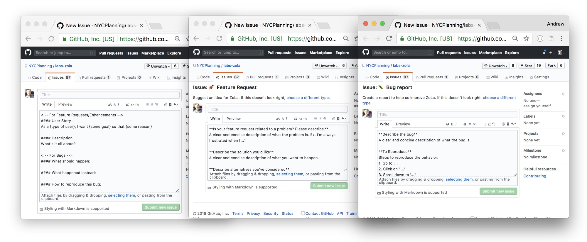

# Contributing

以Gitlab为例，github也类似。

## 流程

- 发现BUG / 缺少Feature
- 创建Issue
- 提交Pull Request (PR)


###发现BUG / 缺少Feature

正常流程为：

1. 发现bug/feature后，去issue list中搜索，或者jira/trello中搜索，看看是否已经有相应项目。
2. 由于团队规模小、项目小，可以直接与对应的人员沟通后，提交新的issue或需求。后面会详细介绍issue/proposal的写法。
3. 若提交issue的同学想解决该问题，那么就可以进入：开发、自测到发出Pull Request的流程。

### 创建issue

如何创建一个合理的issue/proposal。

**创建Proposal**

找到项目的相关人员，“拉群、组会、面聊、。。。”，提出相应的想法。如果Proposal被采纳后，创建对应的需求issue，描述出详细的功能需求、业务场景、优先级程度等等。创建issue或者需求列表的目的主要是为了让所有人可以知晓以及事后查阅。


**创建issue**


描述issue的示例，以go contributing为例，提交issue时，附带如下问题回答，

> 1. What version of Go are you using (`go version`)?
> 2. What operating system and processor architecture are you using?
> 3. What did you do?
> 4. What did you expect to see?
> 5. What did you see instead?


对应的go issue，[issues 20](https://github.com/golang/go/issues/20)


其他的示例：




**通知：**

可以使用`@mentions`方式发出提醒。一般使用：`/cc`加人员列表，例如：

> 相机007号抓拍模式下不上图片，系统版本为v1.0.1，算法版本为v2.0.2，怀疑抓拍阈值设置过高导致，可否紧急追踪一下？
>
>
>
> /cc @zouying @xpzouying


### 提交Pull Request

1. 查找PR/MR，看看是否存在相关的问题；

2. 若没有存在，则确保指定给自己，避免多人重复工作；

3. 分支开发，新建分支。`git checkout -b fix-xx-branch master`

4. 开发修复相应的bug，包括测试用例；

5. 确保开发中遵循后面的规范；

6. 跑通所有的测试，`go test -v ./...`。如果未跑通测试，CI会报错，不允许PR。

7. Commit，确保遵循commit规范。`git commit -a`

8. Push：`git push origin fix-xx-branch`

   > ➜  ac git:(update_router_api) git push -u origin update_router_api
   > Enumerating objects: 9, done.
   > Counting objects: 100% (9/9), done.
   > Delta compression using up to 8 threads
   > Compressing objects: 100% (5/5), done.
   > Writing objects: 100% (5/5), 582 bytes | 582.00 KiB/s, done.
   > Total 5 (delta 4), reused 0 (delta 0)
   > remote:
   > remote: To create a merge request for update_router_api, visit:
   > remote:   https://www.gitlab.com/zouying/ac/merge_requests/new?merge_request%5Bsource_branch%5D=update_router_api
   > remote:
   > To www.gitlab.com:zouying/ac.git
   >
   >  * [new branch]      update_router_api -> update_router_api
   >   Branch 'update_router_api' set up to track remote branch 'update_router_api' from 'origin'.

9. CI测试：Push到远程仓库，会自动触发CI测试，等待CI Jobs完成。

10. 发出Pull Request：描述PR，指定code review的同学。

11. code review通过后，合入master。勾选选项：合入master后，删除分支。避免过多的分支在远程仓库。


## 规范

### 总体规范：

- 提交的issue/feature必须被测试覆盖。TODO(zouying):关于测试相关的内容，后面会详细介绍。

- 需要通过所有的单测，不仅包括新增代码的测试。一般CI中已经包含对所有测试用例的测试。

- 公共的接口需要有文档记录，包括但不限于HTTP API、函数接口等。TODO(zouying): 后面介绍GO的注释规范。

- 编码规范。需要通过go相应的lint工具检测。

- 分支开发，master分支受保护。

- 开发完毕后，发出Pull Request。请求maintain进行code review，需要通过`+2`后才能合并。


### 提交消息 commit message
提交消息组成形式如下：

> ```
> <type>(<scope>): <subject>
> <BLANK LINE>
> <body>
> <BLANK LINE>
> <footer>
> ```


Go官方的规范示例：

> ```
> math: improve Sin, Cos and Tan precision for very large arguments
> 
> The existing implementation has poor numerical properties for
> large arguments, so use the McGillicutty algorithm to improve
> accuracy above 1e10.
> 
> The algorithm is described at https://wikipedia.org/wiki/McGillicutty_Algorithm
> 
> Fixes #159
> ```


### 打分规范

打分分为从-2到2，分别表示：

* -2：拒绝合并。
* -1：评审觉得还有地方需要修改。需要在备注中写明需要修改的部分或原因。
* +1：评审觉得可以，允许合入。由于本人不是maintainer，所以需要其他同学再次确认。
* +2：可以合入。一般只有maintainers才允许+2操作。


参考：

- [github guides - issues](https://guides.github.com/features/issues/)
- [github about issue and pull request templates](https://help.github.com/articles/about-issue-and-pull-request-templates/)
- [how to contribute for golang](https://github.com/golang/go/blob/master/CONTRIBUTING.md)