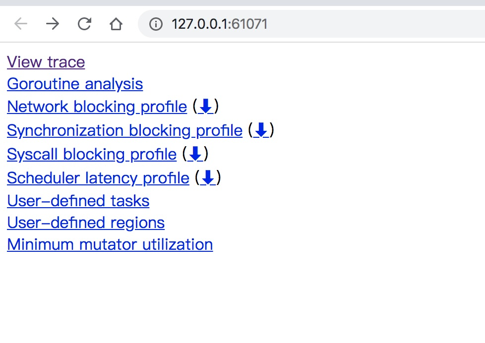
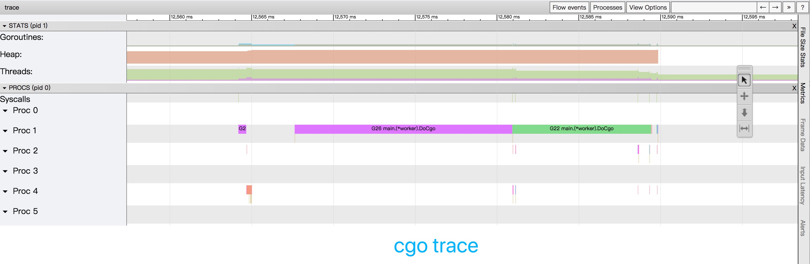
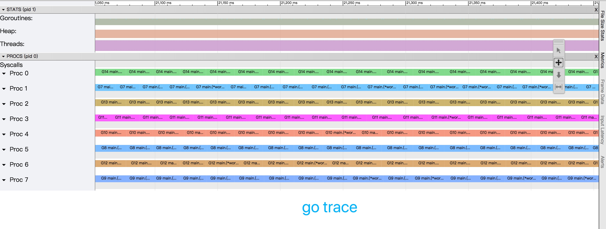

# Profile cgo with trace

Select use go or cgo in main function.

```go
for i := 0; i < cores; i++ {
    w := worker{id: i, reqCh: reqCh}
    go w.DoGo() // Use GO
    // go w.DoCgo()  // Use cgo
}
```


## Trace profile

Use [gotip](https://godoc.org/golang.org/dl/gotip).

`go tool trace` has some bugs in Go v1.14.

** install gotip **

```
$ go get golang.org/dl/gotip
$ gotip download
```

1. run code

```bash
go run main.go
```

2. open trace.out

```bash
gotip tool trace ./trace.out
```


** Why cgo so fast? **

1. pure go cost about: **50s**

```
(base) ➜  how_to_trace_cgo git:(how-to-trace) ✗ time ./go.out 
2020/03/07 00:53:39 got res=-9899999998
2020/03/07 00:53:39 got res=-9900000004
2020/03/07 00:53:39 got res=-9900000000
2020/03/07 00:53:39 got res=-9900000002
2020/03/07 00:53:39 got res=-9900000008
2020/03/07 00:53:39 got res=-9900000006
2020/03/07 00:53:39 got res=-9899999994
2020/03/07 00:53:39 got res=-9900000000
2020/03/07 00:53:54 got res=-9899999996
2020/03/07 00:53:54 got res=-9899999992
./go.out  263.80s user 0.76s system 522% cpu 50.656 total
```

2. go+cgo only cost about: **19.3s**

```
(base) ➜  how_to_trace_cgo git:(how-to-trace) ✗ time ./cgo.out 
2020/03/07 00:54:12 got res=-1310065404
2020/03/07 00:54:12 got res=-1310065410
2020/03/07 00:54:12 got res=-1310065402
2020/03/07 00:54:12 got res=-1310065406
2020/03/07 00:54:12 got res=-1310065408
2020/03/07 00:54:12 got res=-1310065408
2020/03/07 00:54:12 got res=-1310065416
2020/03/07 00:54:12 got res=-1310065412
2020/03/07 00:54:18 got res=-1310065414
2020/03/07 00:54:19 got res=-1310065400
./cgo.out  91.93s user 0.24s system 477% cpu 19.302 total
```


**Trace web:**




**Cgo trace:**




**go trace:**

